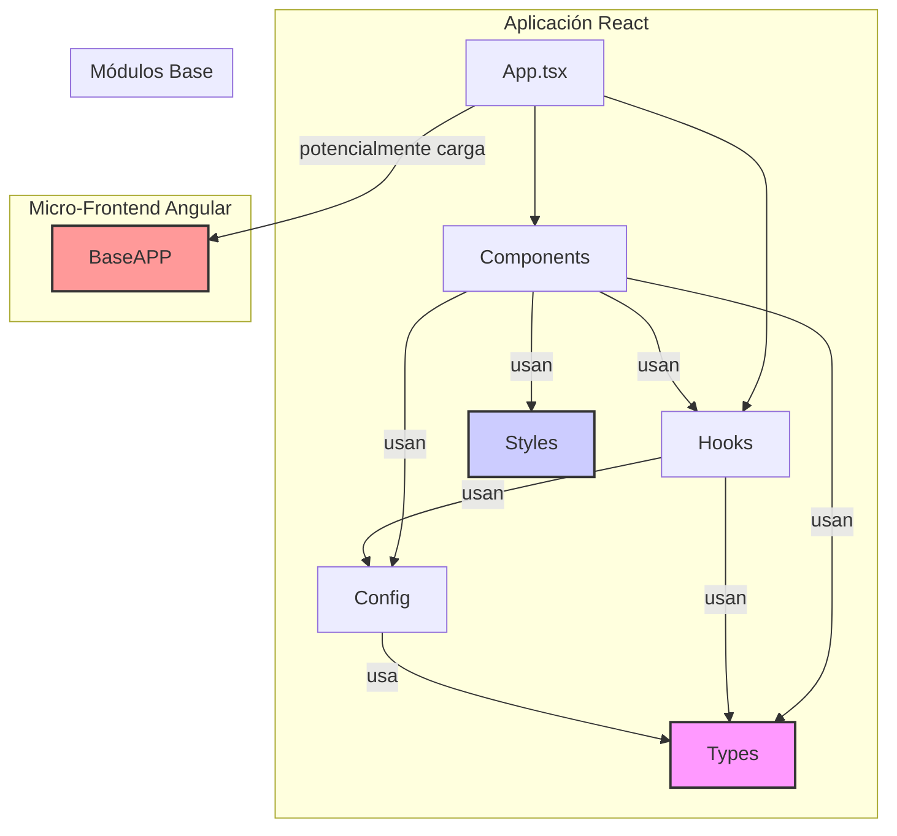

# Arquitectura del Proyecto y Dependencias entre Módulos

## 1. Arquitectura de Alto Nivel: Un Híbrido de React y Angular

La arquitectura de este proyecto es una **Aplicación de Página Única (SPA) híbrida**. El stack principal está construido con **React**, pero incluye una sub-aplicación autocontenida construida con **Angular**.

- **Aplicación Principal (Host):** Es una aplicación React moderna, construida con Vite y TypeScript. Se encarga de la interfaz de usuario principal, la navegación y la orquestación de la lógica de negocio de la plataforma de flujos.
- **Micro-Frontend Angular (`BaseAPP`):** Dentro del proyecto React, existe un módulo (`src/BaseAPP/`) que es una aplicación Angular completa. Este módulo parece ser un "micro-frontend" que gestiona una funcionalidad específica ("AI Studio") y se integra dentro de la aplicación React anfitriona. El método exacto de integración (ej. Iframe, Web Component) no está explícito, pero su naturaleza autocontenida es clara.

Esta arquitectura permite que dos equipos o tecnologías diferentes coexistan, pero introduce una complejidad significativa en términos de dependencias, tamaño del paquete y comunicación entre los dos frameworks.

## 2. Patrón Arquitectónico Principal (en React)

La parte de React de la aplicación sigue un patrón arquitectónico moderno y robusto que separa claramente las responsabilidades. Este patrón se puede describir como **"Hooks Inteligentes, Componentes Tontos" (Smart Hooks, Dumb Components)**.

- **`src/hooks` (La Lógica):** Contienen la lógica de negocio y la gestión del estado. Son "inteligentes" porque saben *qué hacer* y *cómo gestionar los datos*.
- **`src/components` (La UI):** Son en su mayoría "tontos" en el sentido de que su principal responsabilidad es renderizar la UI basándose en las props que reciben. Reciben el estado y las funciones para modificarlo desde los hooks, pero no contienen lógica de negocio compleja por sí mismos.
- **`src/config` (Los Datos):** Externaliza datos y configuraciones (como las plantillas de UI) para que la lógica no esté acoplada a valores estáticos.
- **`src/types` (El Contrato):** Define la estructura de los datos que fluyen entre todos los módulos, actuando como un contrato que garantiza la consistencia.

El refactor del `FlowUIDesigner`, detallado en `src/ARCHITECTURE_DIAGRAM.md`, es el ejemplo perfecto de este patrón en acción.

## 3. Diagrama de Dependencias entre Módulos

A continuación, se muestra un diagrama de cómo los diferentes módulos del proyecto interactúan y dependen unos de otros.

### Descripción de las Dependencias:

- **`App.tsx` (Punto de Entrada):** Es el orquestador principal. Utiliza los `components` para renderizar la UI y los `hooks` para la lógica global. Potencialmente, también es responsable de cargar el micro-frontend `BaseAPP`.

- **`components`:** Es el consumidor principal.
    - Utiliza `hooks` para obtener estado y lógica.
    - Utiliza `styles` para aplicar clases y estilos globales.
    - Utiliza `config` para obtener datos como las plantillas.
    - Utiliza `types` para saber la forma de los datos que maneja.

- **`hooks`:**
    - Utiliza `config` para acceder a la configuración estática.
    - Utiliza `types` para definir su estado interno y la firma de sus funciones.

- **`config`:**
    - Utiliza `types` para garantizar que los objetos de configuración tengan la estructura correcta.

- **`styles` y `types`:** Son módulos base. No tienen dependencias con otros módulos de la aplicación.

- **`BaseAPP`:** Es un módulo aislado. No importa código de los otros módulos de React. Su comunicación con la aplicación principal es probablemente a través de eventos de navegador, `postMessage` (si está en un Iframe), o propiedades de Web Component.

Este flujo de dependencias unidireccional (los componentes dependen de los hooks, los hooks de la configuración, etc.) es una característica de una arquitectura bien diseñada, ya que reduce el acoplamiento y facilita el mantenimiento.